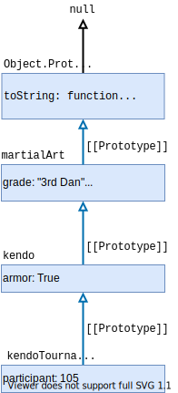

# Inheritance and prototype

## Prototype
In JavaScript, there **always** exists a special property for each object called `[[Prototype]]`, that is either `null` or a reference to another object, called a **prototype**. Prototypes are used to perform **prototypal inheritance**, which means than the prototype of an object **extends** this very object. In other, this allows an object to directly reuse properties and methods from its prototype **automatically**: this is transparent for the developper!

This property `[[Prototype]]` is internal and hidden: you will not iterate over it with `for...in` loop for example -- instead you will iterate overs the properties/methods of the prototype. Their is several ways to access the prototype, such as the historical `__proto__`, but we will not use it anymore. Instead, we will use the class oriented methods, more clean: `Object.getPrototypeOf()` and `Object.setPrototypeOf()`.

Let's illustrate prototype setting and automatic access of the prototypal chain:
```js
let martialArt = {
  grade: "3rd Dan",
  fight(){
    console.log("Tōōōō~~~");
  },
}

let kendo = {
  armor: true,
}

let kendoTournament = {
  participant: 105,
}

Object.setPrototypeOf(kendo, martialArt); // we set the prototype of kendo with martialArt obecjt
Object.setPrototypeOf(kendoTournament, kendo); // IDEM kT with kendo, which has its prototype filed with martialArt!

alert(kendo.armor); //true
alert(kendo.grade); //"3rd Dan"
alert(kendo.participant); // Error // We can't go "down" the prototype chain
alert(kendoTournament.armor); //true
alert(kendoTournament.grade); // "3rd Dan", we go up again in the prototype and get martialArt property!
alert(kendoTournament.fight()); // "Tōōōō~~~"
```

Visually, this give something like:



As you can see, there is one additional prototype, which is the `Object.prototype`. Indeed, when you create an object, JavaScript automatically attach to this object the `Object.prototype` in the exemple: this gives us access to a lot of useful function defined for all the object, such as `toString()`.

### Execution context: `this`
Since `this` is dynamic in JavaScript, an iterrogation may arise: what is the value of `this` once in the prototype chain?

The answer is **always** the initial object calling the property/methods, not the objects from the prototype chain: `this` is not affected by the prototype chain at all.

> ❓ Use the following rule to help you find the value of `this`: no matter where the method is found, `this` is always the object before the `.` (dot)!

```js
let martialArt = {
  grade: "3rd Dan",
  fight(){
    if(this.versus)
      console.log("HAJIME!");
  },
  makeVersus()
  {
    this.versus= true;
  }
}

let kendo = {
  armor: true,
}

Object.setPrototypeOf(kendo, martialArt);

kendo.makeVersus();

alert(kendo.fight); // cli: HAJIME!
alert(martialArt); // Undefined variable this.versus in the prototype
```

What happens here is that the variable `versus` has been attached to the calling object `kendo`, despite the fact the function that creates it is in its prototype (`martialArt`). `martialArt` does not have a `versus` variable after that.

> ⚠️ There is no *hoisting* (cf. [Advanced reminder](advanced.md)) concept involved here!

### Override in writting
The prorotype is only used for **reading** properties and methods, not for writting them. Write operation (as for delete though) works directly with the object itself. Thus, you can rewritte an actual function existing in the prototype by the object's own definition of the method.

```js
let martialArt = {
  grade: "3rd Dan",
  fight(){
    console.log("Tōōōō~~~"); // this method will not longer be used by kendo
  },
}

let kendo = {
  armor: true,
}
Object.setPrototypeOf(kendo, martialArt);

kendo.fight = function(){
  console.log("Geikō time! BANZAI!");
}
alert(kendo.fight); // Geikō time! BANZAI!
```

> ❓ This works as an override because now, JavaScript directly find the method you are calling: thus is does not have the need to go back up the prototype chain.

### Manually extending object: F.prototype
By now, it should be clear how prototype can be used for object inheritance. As stated above, this is called **prototypal inheritance**. Here we will see how we can extend an object using constructor function and `new` operator by using a property named `prototype`.

> ⚠️ Here we speak of a *special* property called `prototype`, not the `[[Prototype]]` seen above. It is only used once: while construction an object *via* a function thanks to `new`.

This property `prototype` of a constructor function (cf. [OOP section](poo.md)) means the following: "When a `new` object is created (by using the `new` operator), assigns its `[[Prototype]]` to the given object". By this mean, all the objects from a constructor function created with `new` will all have the object as prototype.

```js
let martialArt = {
  grade: "3rd Dan",
  fight(){
    console.log("Tōōōō~~~"); // this method will not longer be used by kendo
  },
}

function Kendoka(armor){
  this.armor = armor;
}

Kendoka.prototype = martialArt; // all the instance of Kendoka will have martialArt object in their direct prototype chain

let kendo = new Kendoka(true);
alert(kendo.grade) // 3rd Dan
```


## another sec
### Protected and private inheritance: reminder

### static inheritance
https://javascript.info/static-properties-methods#inheritance-of-static-properties-and-methods

### Mixins: or multi-inheritance 


## Method and function borrowing
bind, call, apply()
https://www.codingame.com/playgrounds/9799/learn-solve-call-apply-and-bind-methods-in-javascript

hook : 
```js
var hooks = {};

function add_to_function(name, func) {
  if(!hooks[name]) hooks[name] = [];
  hooks[name].push(func);
}

function call_my_function(name, ...params){
  if(hooks[name]) 
     hooks[name].forEach(func => func(...params));
}
```