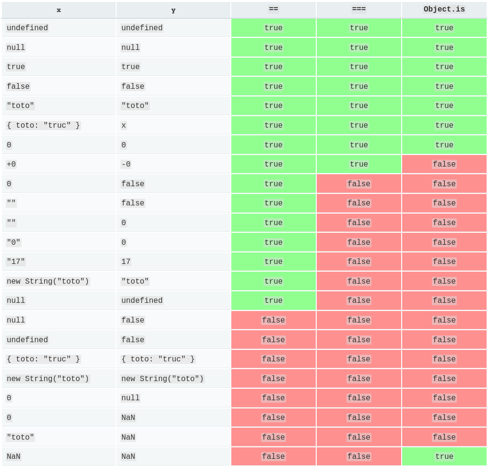

# Reminders

JavaScript is a weakly typed language, mostly used to manipulate the DOM of a web page.

Additionally, JavaScript is an object-oriented language (but it allows imperatif and also lambda calculus). However, its main difference with language like Java or C++ is that it is a **prototype based language** and **not** a class based one. We will saw the implication of such a statement in the [Object-oriented programming](poo.md) section.
Briefly said, anything but primitive types is an object in JavaScript.

This section serves as a quick reminder, mostly regarding the syntax, for several important notions.

## Language core

### Condition
#### Statement
JavaScript has **three** different conditionals, well known in other languages as well.

The `if...else` conditional.
```js
if(condition)
{
  //code
}
else if(cond2)//optionnel
{
  //code
}
else
{
  //code
}
```

The ternary statement.
```js
(condition) ? instruction;if;true; : instruction;if;false;
```

The `switch` statement.
```js
switch (expression) // NOT a condition
{
  case 1:
    code;
    break;
  case 2:
    code:
    break;
  default:// Don't forget me
    code; //no break needed, we are at the end
}
```

#### Strict egality vs. egality
JavaScript has **three** different ways to perform an egality check, either with their own specificity.

The first one is the simple equality made by the `==` operator. It **does** make a data type converstion before the comparison of the objects. You can have important side effects if not used correctly.
```js
console.log('1' ==  1);// CLI: true
```

The second equality operator is the strict operator `===` (3 `=`). The most notable difference between this operator and the simple equality operator is that if the operands are of different types, it **will not attempt** to convert them to the same type before comparing.
```js
console.log('1' ===  1);// CLI: false
```

The last equality operator is `Object.is()` operator. It determines whether two values are **the same value**. It is widely different to `==` since it does not perform coerce checks, and differ from `===` in regard that it treats the number values `-0` and `+0` as equal and treats `Number.NaN` as not equal to `NaN`.
```js
var foo = { a: 1 };
var bar = { a: 1 };
Object.is(foo, foo);         // CLI: true
Object.is(foo, bar);         // CLI: false
```


### Loops
In JavaScript, the 3 classic loop structures are available:
* `for`
* `while`
* `do...while`

The `for` loop repeats until a specified condition evaluates to false. A `for` statement looks as follow:
```js
for(let i = 0; i < selectObject.options.length; i++)
{
    //instructions goes here
}
```

The `do...while` statement repeats until a specified condition evaluates to false. It looks as follows (do not forget the semi colon at the end of the while instruction):
```js
let i = 0;
do {
    i += 1;
    console.log(i);
} while (i < 5);
```

A `while` statement executes its statements as long as a specified condition evaluates to true. It looks as follows:
```js
let i = 2;
while (i < 65536) {
  n*=n;
}
```

### Data types
JavaScript is weakly typed, meaning that the variables do not have a specific on their declaration. Instead, we use a generic keyword declaration to declare a new variable.

There is only **three** declaration keywords in JS. They are:

* `let`: allows the declaration of a block scope **local variable** (it is destroyed while outside the block) ; it can optionally be initialized to a value ;
* `var`: declares a variable, optionally initializing it to a value ;
* `const`: declares a read-only named constant.

```js
var myVar = 7;
```

### Function
Basically, a function is defined by its name, and its parameters. It **does not** have a return type: therefore you must be carreful about how the code is documented.
A function declaration looks as follow:
```js
function foo(param1, param2)
{
  //instruction
  return result; //optional
}
```

To invoke a function:
```js
foo(7777, "hello");
```